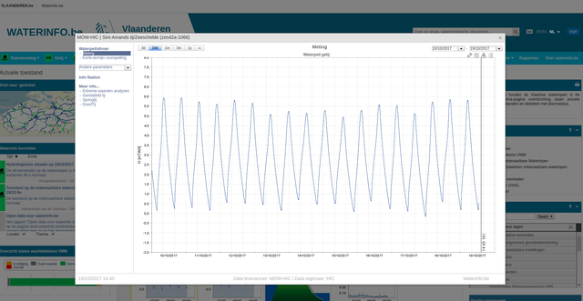

```{r, include=FALSE}
library(dplyr)
library(ggplot2)
```

## Introduction

The [waterinfo.be](https://www.waterinfo.be) API uses a system of identifiers, called `ts_id` to define individual time series. For example, the identifier `ts_id = 78073042` corresponds to the time series of air pressure data for the measurement station in Liedekerke, with a 15 min time resolution. Hence, the `ts_id` identifier defines a variable of interest from a measurement station of interest with a specific frequency (e.g. 15 min, hourly,...). The knowledge of the proper identifier is essential to be able to download the corresponding data.

```{r load_lib, echo = FALSE}
library(wateRinfo)
```

## Downloading with known `ts` identifier

In case you already know the `ts_id` identifier that defines your time serie, the package provides the function `get_timeseries_tsid` to download a specific period of the time series. 

As an example, to download the air pressure time series data of Liedekerke with a 15 min resolution (`ts_id = 78073042`) for the first of January 2016:

```{r tsdownload}
my_data <- get_timeseries_tsid("78073042", from = "2016-01-01", to = "2016-01-02")
knitr::kable(head(my_data), align = "lcc")
```

For more information on defining the period of the download, a separate vignette is available. Let's have a visual check of our data, using the `ggplot2` package:

```{r tsvisual, fig.width = 7}
ggplot(my_data, aes(Timestamp, Value)) + 
    geom_line()
```

As such, knowing the identifier is the most straightforward way of downloading a time series. In order to find these `ts_id` identifier, the package supports looking for identifiers based on a supported variable name (limited set of supported variables by VMM) or looking for identifiers by checking all variables for an individual station. These methods are explained in the next sections. 

## Search identifier based on variable name

For a number of variables, the [documentation of the Waterinfo.be API](https://www.waterinfo.be/download/9f5ee0c9-dafa-46de-958b-7cac46eb8c23?dl=0) provides a direct overview option of all available VMM measurement stations, using the so-called `Timeseriesgroup_id`. For these variables, the package provides the function `get_stations` to download an overview of available measurement stations and the related `ts_id` identifiers. The latter can be used to [download the time series](#Downloading-with-known-ts-identifier). 

```{r statofvar}
get_stations("air_pressure")
```

By default, the expected frequency is the 15 min frequency of the time series. However, for some of the variables, multiple frequencies are supported by the API. The package provides a check on the supported variables and frequencies. An overview of the currently supported variables can be requested with the command `supported_variables()` (either in dutch, `nl`, or in english, `en`). Actually, more variables are available with the API (see next section), but for each of these variables the `get_stations` function is supported (i.e. the `Timeseriesgroup_id` is documented by VMM). 

```{r suppvar}
supported_variables("en") %>% 
    as.list()
```

To check which predefined frequencies are provided by the Waterinfo.be API for a given variable, the `supported_frequencies` function is available:

```{r suppfreq1}
supported_frequencies(variable_name = "air_pressure")
```

Hence, for air pressure data, only the 15 min resolution is supported. Compared to evaporation derived by the [Monteith equation](https://en.wikipedia.org/wiki/Penman%E2%80%93Monteith_equation):

```{r suppfreq2}
supported_frequencies(variable_name = "evaporation_monteith")
```

Multiple resolutions are available. Using the coarser time resolutions can be helpful when you want to download longer time series while keeping the number of records to download low (if the frequency would be sufficient for your analysis):

```{r statofvarwithfreq}
stations <- get_stations("evaporation_monteith", frequency = "year")
subset_of_columns <- stations %>% select(ts_id, station_no, station_name, 
                                         parametertype_name, ts_unitsymbol)
knitr::kable(subset_of_columns)
```

When interesed in the data of `Herentals_ME`, we can use the corresponding `ts_id` to download the time series of PET with a yearly frequency and make a plot with `ggplot`:

```{r yearly_pet, fig.width = 7}
pet_yearly <- get_timeseries_tsid("94526042", period = "P10Y")
pet_yearly %>% 
    na.omit() %>%
    ggplot(aes(Timestamp, Value)) + 
    geom_bar(stat = "identity") +
    scale_x_datetime(date_labels = "%Y", date_breaks = "1 year") + 
    xlab("") + ylab("PET Herentals (mm)")
```

(see the vignette on defining date periods for more information on the period argument used)

**Remark:** the `get_stations` function only works for those measurement stations belonging to the VMM `meetnet` (network), related to the so-called `datasource = 1`. For [other networks](http://www.waterinfo.be/default.aspx?path=NL/HIC/Recent_toelichting), i.e. `datasource = 2`, the enlisting is not supported. Still, a search for data is provided starting from a given station name, as explained in the next section.

## Search identifier based on station name

Apart from the option to check the measurement stations that can provide data for a given variable, the package provides the function `get_variables` to get an overview of the available variables for a given station, using the `station_no`. The advantage compared to the `ts_id` is that these `station_no` names are provided by the waterinfo.be website itself when exploring the data. When clicking on a measurement station on the map and checking the time series graph, the `station_no` is provided in the upper left corner in between brackets. 



So, for the example in the figure, i.e. `station_no = zes42a-1066`, the available time series are retrieved by using the `get_variables` command:

```{r varforstat}
available_variables <- get_variables("zes42a-1066")
available_variables %>% select(ts_id, station_name, ts_name, 
                               parametertype_name)
```

The available number of variables depends on the measurement station. The representation is not standardized and depends also from the type of [`meetnet`](http://www.waterinfo.be/default.aspx?path=NL/HIC/Recent_toelichting). Nevertheless, one can derive the required `ts_id` from the list when interpreting the field names. Remark that the datasource can be 2 instead of 1 for specific `meetnetten` (networks). The datasource to use is printed when asking the variables for a station. 

In order to download the 10 min time series water level data for the station in Sint-Amands tij/Zeeschelde, the `ts_id = 2810011` can be used in the `get_timeseries_tsid` function, taking into account the `datasource = 2` (default is 1):

```{r downloadstamands, fig.width = 7}
tide_stamands <- get_timeseries_tsid("2810011", 
                                     from = "2017-06-01", to = "2017-06-05",
                                     datasource = 2)
ggplot(tide_stamands, aes(Timestamp, Value)) + 
    geom_line() + xlab("") + ylab("waterlevel")
```

For some measurement stations, the number of variables can be high (lots of precalculated derivative values) and extracting the required time series identifier is not always straightforward. For example, the dat Etikhove/Schuif/Nederaalbeek (`K06_OM225`), provides the following number of variables:

```{r check_bekken}
available_variables <- get_variables("K06_OM225")
nrow(available_variables)
```

As the measured variables at a small time resolution are of most interest, filtering on `P.15` (or `P.1`, `P.60`,...) will help to identify measured time series, for those stations belonging to the `meetnet` of VMM (`datasource = 1`):

```{r check_bekken_filter}
available_variables <- get_variables("K06_OM225")
available_variables %>% 
    filter(ts_name == "P.15")
```

Loading and visualizing the last day (period `P1D`) of available data for the water level 100m downstream (`Hafw 100m afwaarts`):

```{r afw_etik_fig, fig.width = 7}
afw_etikhove <- get_timeseries_tsid("29156042", 
                                    period = "P1D",
                                    datasource = 1) # 1 is default

ggplot(afw_etikhove, aes(Timestamp, Value)) + 
    geom_line() + xlab("") + ylab("Volume")
```

We can do similar filtering to check for time series on other stations, for example the Molenbeek in Etikhove:

```{r check_etikhove}
available_variables <- get_variables("LS06_347")
available_variables %>% 
    filter(ts_name == "P.15")
```

And use the `ts_id` code representing discharge to create a plot of the discharge during a storm in 2010:

```{r disch_etik, fig.width = 7}
etikhove <- get_timeseries_tsid("70346042", 
                                from = "2010-11-09", to = "2010-11-16")

ggplot(etikhove, aes(Timestamp, Value)) + 
    geom_line() + xlab("") + ylab("Q (m3/s)")
```
